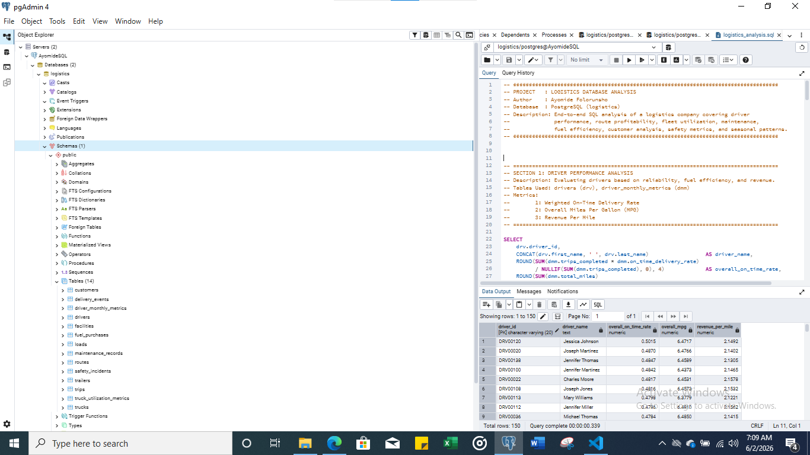

# 🚚 Logistics Database Analysis — SQL Project

**Author:** Ayomide Folorunsho 
**Database:** PostgreSQL 
**Tools:** PostgreSQL · pgAdmin / psql 
**Dataset Period:** January 2022 – December 2024 (36 months)

---

## 📋 Project Overview

End-to-end SQL analysis of a simulated logistics company covering **8 analytical domains**: driver performance, route profitability, fleet utilization, maintenance, fuel efficiency, customer analysis, safety metrics, and seasonal patterns.

The goal was to surface actionable operational insights from raw transactional data using SQL.

This project was built entirely from scratch —  the raw data tables were downloaded, a local PostgreSQL database was set up, imported each table manually, defined relationships, and all queries written from the ground up

---

## 🗃️ Data Source

This project uses a simulated logistics dataset consisting of 14 relational tables covering fleet operations, transportation, maintenance, customer activity, fuel purchases, and safety incidents.

The dataset was imported into PostgreSQL and analysed using SQL.

---

## ⚙️ Database Setup

1. Downloaded PostgreSQL and set up a local server
2. Created a new database called `logistics`
3. Imported all raw CSV tables into the database
4. Verified table relationships and data integrity
5. Wrote and executed all queries in pgAdmin

---

## 📁 Project Structure

```

logistics-sql-analysis/
│
├── Logistics_Database_Analysis.sql       # All 10 queries (8 sections)
│
├── query_outputs/
│   ├── DRIVER_PERFORMANCE_ANALYSIS.csv
│   ├── FLEET_UTILIZATION_ANALYSIS.csv
│   ├── MAINTENANCE_ANALYSIS.csv
│   ├── ROUTE_PROFITABILITY_ANALYSIS.csv
│   ├── SAFETY_METRICS_ANALYSIS.csv
│   ├── SEASONAL_PATTERNS_ANALYSIS.csv
│   ├── 5a_Monthly_fleet_MPG_trend.csv
│   ├── 5b_Fuel_cost_by_route.csv
│   ├── 6a_Revenue_by_customer_type.csv
│   └── 6b_Service_levels_by_customer_type.csv
│
├── images/
|
└── README.md

```

## 🗃️ Database Schema 

| Table | Description |
|---|---|
| `drivers` | Driver demographics, employment history, license info |
| `driver_monthly_metrics` | Monthly performance summaries per driver |
| `trucks` | Fleet equipment details, acquisition info, status |
| `truck_utilization_metrics` | Monthly equipment utilization summaries |
| `maintenance_records` | Service history, costs, downtime |
| `routes` | Origin-destination pairs, distances, rate structures |
| `loads` | Shipment details, revenue, booking type |
| `trips` | Actual trip performance, fuel consumption, duration |
| `fuel_purchases` | Fuel transactions, prices, locations |
| `customers` | Customer accounts, contract types, revenue potential |
| `delivery_events` | Pickup/delivery timestamps, detention, on-time status |
| `safety_incidents` | Accidents, violations, damage costs |
| `trailers` | Trailer inventory, types, status |
| `facilities` | Terminal and warehouse locations, capacity |



---

## 🔍 SQL Techniques Used

| Technique | Where Applied |
|---|---|
| `LEFT JOIN` across 3–4 tables | Sections 2, 4, 5b |
| Weighted average (trip-weighted on-time rate) | Section 1 |
| `NULLIF()` for safe division | Sections 1, 2, 3, 5b, 6b |
| `CASE WHEN` for conditional aggregation | Sections 6b, 7 |
| `ROLLUP` for subtotals | Section 7 |
| `COALESCE` to label rollup rows | Section 7 |
| `TO_CHAR` / `DATE_TRUNC` for date formatting | Sections 5a, 8 |
| `CONCAT` for readable label columns | Sections 1, 2, 3, 4 |
| `COUNT(DISTINCT ...)` | Section 6a |
| Subquery in `SELECT` clause | Section 7 |
| `NULLS LAST` in `ORDER BY` | Sections 1, 3, 4 |

---

## Sample SQL Query

```sql

-- ====================================================================================
-- SECTION 1: DRIVER PERFORMANCE ANALYSIS
-- Description: Evaluating drivers based on reliability, fuel efficiency, and revenue.
-- Tables Used: drivers (drv), driver_monthly_metrics (dmm)
-- Metrics:
--        1: Weighted On-Time Delivery Rate
--        2: Overall Miles Per Gallon (MPG)
--        3: Revenue Per Mile
-- ====================================================================================

SELECT
    drv.driver_id,
    CONCAT(drv.first_name, ' ', drv.last_name)                  AS driver_name,
    ROUND(SUM(dmm.trips_completed * dmm.on_time_delivery_rate)
          / NULLIF(SUM(dmm.trips_completed), 0), 4)             AS overall_on_time_rate,
    ROUND(SUM(dmm.total_miles)
          / NULLIF(SUM(dmm.total_fuel_gallons), 0), 4)          AS overall_mpg,
    ROUND(SUM(dmm.total_revenue)
          / NULLIF(SUM(dmm.total_miles), 0), 4)                 AS revenue_per_mile
FROM drivers AS drv
LEFT JOIN driver_monthly_metrics AS dmm
    ON drv.driver_id = dmm.driver_id
GROUP BY
    drv.driver_id,
    CONCAT(drv.first_name, ' ', drv.last_name)
ORDER BY overall_on_time_rate DESC NULLS LAST;

```

---

## 📊 Key Findings & Insights

### 1. Driver Performance

- **150 drivers** were analysed. **26 drivers returned NULL** across all metrics — indicating no trip data was logged. These are likely inactive or newly onboarded drivers and represent a **data quality / onboarding flag**.
- The **top performer** is Jessica Johnson (DRV00120) with a **50.15% on-time rate** and **6.47 MPG**.
- The **bottom performer** among active drivers is Mary Wilson (DRV00133) with only a **37.33% on-time rate** — 13 percentage points below the top driver.
- **On-time rates are remarkably flat** — the entire active fleet sits between **37% and 50%**, suggesting a **systemic operational issue** (e.g. scheduling, route timing, or customer appointment windows) rather than individual driver failure.
- **Revenue per mile is tightly clustered** between $2.09–$2.20, indicating uniform load pricing across the fleet.
- **MPG ranges from 6.38–6.53** fleet-wide — very little variation, suggesting consistent truck specs or speed policies.

> 💡 **Insight:** The consistently low on-time delivery rates observed across the active driver population suggest potential network-wide operational challenges that warrant further investigation.

---

### 2. Route Profitability

- **58 routes** were analysed across the US network.
- The **most profitable route** is Seattle → Charlotte ($21.5M gross after fuel) — a 2,623-mile long-haul lane generating the highest absolute margin.
- **Top 5 routes by gross margin** are all long-haul (2,269–2,729 miles), driven by higher revenue density on transcontinental loads.
- **Fuel cost as % of revenue** ranges from **65.94% (Charlotte to Denver)** to **83.84% (Philadelphia to New York)**.
- **Short-haul routes are the least efficient**: Philadelphia ↔ New York (92 miles) has an 83.84% fuel cost ratio — meaning only ~16 cents of every revenue dollar survives after fuel alone.
- **Las Vegas to New York** (2,561 miles) is an outlier — despite its length, it has a **66.62% fuel cost ratio**, one of the best in the network, making it a high-value lane.

> 💡 **Insight:** Short-haul routes (under 300 miles) consistently show fuel costs above 80% of revenue. The business should consider whether these lanes are viable after accounting for driver pay, maintenance, and overhead — or whether they exist only to reposition equipment.

---

### 3. Fleet Utilization

- **120 trucks** in the fleet. **28 trucks returned NULL** — no utilization data recorded, meaning they are inactive, in maintenance, or recently acquired.
- The **highest-utilised truck** (TRK00055, 2017 Peterbilt) drove **1,417,530 miles** and generated **$2.99M in revenue**.
- The **lowest-utilised active truck** (TRK00040, 2015 International) drove **1,178,515 miles** — a **~17% gap** vs the top truck over the same period.
- **Revenue per mile is consistent** at $2.11–$2.19 across the entire active fleet, showing load pricing is uniform regardless of truck assignment.
- Trucks based in **Atlanta, Denver, and Los Angeles** appear among the top utilisers.

> 💡 **Insight:** The 28 inactive trucks represent significant idle capacity. Further investigation is required to determine whether inactivity is driven by maintenance , driver shortages, or operational constraints.
---

### 4. Maintenance Analysis

- **TRK00073 (2016 Mack)** has the highest total maintenance cost at **$2.76M** but a relatively moderate **$0.053/mile** — it logged heavy mileage.
- **TRK00040 (2015 International)** has the highest **cost per mile at $0.079** — the most expensive truck to operate per distance unit.
- **TRK00073** also leads in **downtime at 35,867 hours** — roughly **4 years of continuous downtime** over the analysis period. At a fleet scale, this is enormous lost operational capacity.
- Several **inactive trucks** (NULL cost-per-mile) still show maintenance costs in the $25K–$90K range — they're being maintained but not generating revenue.
- The **most efficient trucks** by cost/mile are TRK00007 ($0.035), TRK00083 ($0.033) — both newer models (2019 Volvo, 2015 Kenworth with fewer events).

> 💡 **Insight:** High downtime hours and high cost-per-mile together identify trucks that should be evaluated for early retirement or replacement. TRK00040's $0.079/mile cost is nearly double the most efficient trucks — a clear flag for the asset management team.

---

### 5. Fuel Efficiency

**5a — Monthly MPG Trend (Fleet-wide)**
- Fleet MPG stayed **remarkably stable between 6.40 and 6.53** across all 36 months (Jan 2022 – Dec 2024).
- There is a **slight upward drift in late 2024** (Sep–Nov 2024 averaging 6.52+), possibly reflecting newer trucks entering the active fleet or improved routing.
- No dramatic seasonal dips — suggesting speed policies or engine standards are consistently enforced.

**5b — Fuel Cost by Route**
- **Philadelphia ↔ New York** have the highest fuel cost per mile (~$5.30/mile) — driven by urban stop-and-go traffic and short trip economics.
- **Long-haul routes (2,000+ miles)** have fuel cost per mile as low as **$0.16–$0.24**, owing to highway efficiency.
- Average fuel cost per trip is **strikingly consistent at ~$484–$494** regardless of route length — suggesting fuel purchases are made in standard fill-up amounts, not route-optimised.

> 💡 **Insight:** The near-uniform per-trip fuel purchase amount across all routes ($484–$494) is unusual. Long-haul routes should cost more in fuel per trip. This may indicate a data modelling artefact, or that drivers consistently purchase the same dollar amount regardless of route — a target for fuel purchase policy review.

---

### 6. Customer Analysis

**6a — Revenue by Customer Type**
| Customer Type | Customers | Total Revenue | Avg Rev/Load |
|---|---|---|---|
| Contract | 75 | $98.8M | $3,067 |
| Spot | 63 | $82.9M | $3,085 |
| Dedicated | 62 | $80.9M | $3,070 |

- **Contract customers dominate revenue** ($98.8M) — 37.7% of total revenue from the largest customer base.
- **Spot customers generate the highest revenue per load** ($3,085) — consistent with the spot market premium over contracted rates.
- Revenue per load is **tightly clustered across all three types** (~$3,067–$3,085), suggesting load sizes and lane mix are similar across customer segments.

**6b — On-Time Delivery by Customer Type**
| Customer Type | On-Time % | Avg Detention (min) |
|---|---|---|
| Contract | 44.87% | 105.87 |
| Spot | 44.74% | 106.99 |
| Dedicated | 44.16% | 107.10 |

- **On-time performance is nearly identical across all three customer types** — and uniformly poor (~44%).
- All customer types experience **~1 hr 45 min average detention**, with Dedicated customers facing slightly longer waits.
- The consistency across types again points to a **network-wide scheduling or appointment-setting problem**, not a customer-specific one.

> 💡 **Insight:** Dedicated customers — who typically pay a premium for reliability — have the worst on-time rate (44.16%) and longest detention. This is a contract risk. If SLAs are tied to on-time delivery, the company may be exposed to service credits or churn among its most committed customer segment.

---

### 7. Safety Metrics

- **170 total incidents** recorded across the analysis period.
- **DOT Violations** are the most frequent incident type (**39 incidents, 22.94%**) — and the most costly in total claims ($581K).
- **Equipment Damage** has the highest average claim per incident (**$21,171**) — nearly 1.5x the next highest type.
- **64 of 170 incidents (37.6%) were preventable** — meaning more than one-third of all safety claims could have been avoided.
- **Accidents and Customer Complaints** each account for ~20.6% of incidents.
- **Moving Violations** are the least frequent (27) but carry a **$15,216 average claim** — suggesting they tend to escalate into costly outcomes when they do occur.

> 💡 **Insight:** DOT Violations being the #1 incident type is a serious operational and compliance concern. Regulatory violations can result in CSA scores affecting operating authority. A targeted Hours-of-Service (HOS) compliance program and pre-trip inspection audit could directly reduce the top incident category.

---

### 8. Seasonal Patterns

- **Revenue is remarkably stable** across all 36 months — ranging from ~$6.57M (Feb 2022) to ~$7.72M (Aug 2022).
- **February is consistently the lightest month** each year (2022: $6.57M, 2023: $6.62M, 2024: $6.97M).
- **August–October** tends to be the strongest window, reflecting typical freight seasonality (back-to-school, pre-holiday inventory builds).
- **Load volume mirrors revenue**: Feb dips to ~2,136–2,267 loads/month vs peaks of 2,474–2,496 in October/August.
- **Average revenue per load is stable** at ~$3,017–$3,148 throughout — no significant rate compression or surge pricing detected.

> 💡 **Insight:** The February dip is consistent and predictable. The company could use this window for planned fleet maintenance, driver training, and equipment inspections — turning a revenue trough into a productive operational reset period.

---

## ✅ Recommendations Summary

| Priority | Area | Recommendation |
|---|---|---|
| 🔴 High | On-Time Delivery | Investigate systemic root cause of sub-50% on-time across all driver/customer segments |
| 🔴 High | Safety / Compliance | Launch DOT Violation reduction programme — #1 incident type by frequency |
| 🟠 Medium | Fleet Idle Assets | Audit 28 inactive trucks — potential $78M+ in unrealised annual revenue |
| 🟠 Medium | Short-Haul Routes | Evaluate viability of routes under 300 miles with >80% fuel cost ratios |
| 🟡 Low | Fuel Purchasing | Review uniform ~$490 per-trip fuel purchase pattern across all route lengths |
| 🟡 Low | Driver Data Quality | Investigate 26 drivers with no trip records — onboarding or system issue |
| 🟡 Low | February Planning | Schedule maintenance and training during consistent seasonal trough |

---

ide | LinkedIn/Twitter: @folorunshoayomide5*
